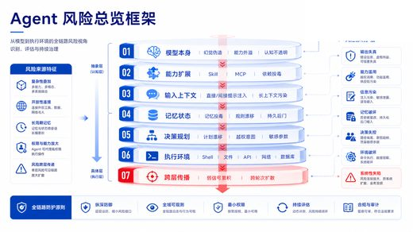

# Awesome Codex PPT Skills

[中文](README.zh-CN.md)

Open-source skills and tools that let **Codex, Claude Code and other coding agents make slides**: editable PPTX, image-first decks, web slides, consulting-style decks, documents to slides. 205 repos, each one read and security-graded by [Agent Skills Hub](https://agentskillshub.top?utm_source=github&utm_medium=awesome-list).

Live page with filters: **[https://agentskillshub.top/best/ppt-presentation/](https://agentskillshub.top/best/ppt-presentation/?utm_source=github&utm_medium=awesome-list)** · refreshed every 8 hours

## What these tools make

<table>
<tr>
<td align="center" valign="top" width="33%"><b>🧱 Frameworks & toolkits</b> 20 repos   Large toolkits and multi-agent systems that make many kinds of decks. <a href="#type-general"><b>View the list →</b></a></td>
<td align="center" valign="top" width="33%"><b>📝 Editable PPTX</b> 83 repos   Real .pptx files you can open and edit in PowerPoint. <a href="#type-pptx"><b>View the list →</b></a></td>
<td align="center" valign="top" width="33%"><b>🖼 Image-first decks</b> 6 repos   Each slide is a generated image: striking, but the text is fixed. <a href="#type-image"><b>View the list →</b></a></td>
</tr>
<tr>
<td align="center" valign="top" width="33%"><b>🌐 Web slides</b> 55 repos   Slides as a web page: reveal.js, Slidev, magazine-style decks. <a href="#type-html"><b>View the list →</b></a></td>
<td align="center" valign="top" width="33%"><b>💼 Business & consulting</b> 14 repos   Consulting, pitch and report decks. <a href="#type-business"><b>View the list →</b></a></td>
<td align="center" valign="top" width="33%"><b>📄 Docs to slides</b> 27 repos   Papers, PDFs, articles and Markdown turned into slides. <a href="#type-convert"><b>View the list →</b></a></td>
</tr>
</table>

## Contents

- [🧱 Frameworks & toolkits](#type-general) (20)
- [📝 Editable PPTX](#type-pptx) (83)
- [🖼 Image-first decks](#type-image) (6)
- [🌐 Web slides](#type-html) (55)
- [💼 Business & consulting](#type-business) (14)
- [📄 Docs to slides](#type-convert) (27)

## How a repo gets on the list

1. It makes slide decks or presentations (PPT, PPTX, Keynote, HTML slides). A document or a poster generator does not count.
2. An agent operates it: a skill, a plugin, an MCP server, or a toolkit written for the agent.
3. It has a README. Without one it cannot be graded.
4. At 50 stars or more it is listed on topic alone. Under 50 it must also clear a README quality bar (shows the result, one-command start, a concrete outcome, complete docs), and have 5 stars.

The questions are answered by a decision model reading each README, not by hand. A repo near a cut-off can land on either side; open an issue if one is misfiled.

## 🧱 Frameworks & toolkits

[Open this type on the live page, sorted by stars →](https://agentskillshub.top/best/ppt-presentation/?utm_source=github&utm_medium=awesome-list#type-general)

<table><tr>
<td align="center" valign="top"> <a href="https://github.com/wuyoscar/GPT-Image2-Skill">wuyoscar/GPT-Image2-Skill</a></td>
<td align="center" valign="top"> <a href="https://github.com/minorun365/minorun-marp-skill">minorun365/minorun-marp-skill</a></td>
<td align="center" valign="top"> <a href="https://github.com/gnipbao/knowledge-cat-ppt-skill">gnipbao/knowledge-cat-ppt-skill</a></td>
</tr></table>

| Repo | Stars | What it does | Security |
|---|---:|---|---|
| [wuyoscar/GPT-Image2-Skill](https://github.com/wuyoscar/GPT-Image2-Skill) | 5.6k | GPT Image 2/2.5 prompt gallery, image prompt library, agentic skill, and CLI for OpenAI image generation/editing | [SAFE](https://agentskillshub.top/skill/wuyoscar/GPT-Image2-Skill/?utm_source=github&utm_medium=awesome-list) |
| [Binaryify/open-kimi-ppt-skill](https://github.com/Binaryify/open-kimi-ppt-skill) | 1.6k | 非官方 Kimi Slides Skill：让 AI Agent 生成可编辑 PPTD + PPTX，并附带本地浏览器编辑器 Unofficial Kimi Slides skill for AI agents — generate editable PPTD + PPTX with a loca… | [SAFE](https://agentskillshub.top/skill/Binaryify/open-kimi-ppt-skill/?utm_source=github&utm_medium=awesome-list) |
| [tfriedel/claude-office-skills](https://github.com/tfriedel/claude-office-skills) | 834 | Office document creation and editing skills for Claude Code - PPTX, DOCX, XLSX, and PDF workflows with automation support | [SAFE](https://agentskillshub.top/skill/tfriedel/claude-office-skills/?utm_source=github&utm_medium=awesome-list) |
| [mucsbr/ppt-agent-workflow-san](https://github.com/mucsbr/ppt-agent-workflow-san) | 643 | 渐进交互式ppt生成skill | [SAFE](https://agentskillshub.top/skill/mucsbr/ppt-agent-workflow-san/?utm_source=github&utm_medium=awesome-list) |
| [minhnv0807/ai-business-skills](https://github.com/minhnv0807/ai-business-skills) | 606 | 138 bilingual AI marketing skills (69 VN + 69 Global) for Claude Code, OpenCode, Codex, VS Code. Four role SOP packs — content, design, performance,… | [SAFE](https://agentskillshub.top/skill/minhnv0807/ai-business-skills/?utm_source=github&utm_medium=awesome-list) |
| [minorun365/minorun-marp-skill](https://github.com/minorun365/minorun-marp-skill) | 402 | Marpで登壇スライドを作るための、ストーリー・図・デザインバランスのスキル集と黒地テーマ、検査ツール | [SAFE](https://agentskillshub.top/skill/minorun365/minorun-marp-skill/?utm_source=github&utm_medium=awesome-list) |
| [rsrohan99/presenter](https://github.com/rsrohan99/presenter) | 186 | A Multi-Agent AI Tool that creates beautiful presentations with voice-overs 🎦🔥 | [SAFE](https://agentskillshub.top/skill/rsrohan99/presenter/?utm_source=github&utm_medium=awesome-list) |
| [Sven-LI-sankyuu/presentation-skills](https://github.com/Sven-LI-sankyuu/presentation-skills) | 175 | 面向 Codex CLI 的演示工作流 skills 集合，包括商业级可编辑 PPT 协作与网页 demo 配音视频合成等可复盘、可复用流程。A Codex CLI skill collection for reusable presentation workflows, covering edi… | [SAFE](https://agentskillshub.top/skill/Sven-LI-sankyuu/presentation-skills/?utm_source=github&utm_medium=awesome-list) |
| [StarryKit/starry-slides](https://github.com/StarryKit/starry-slides) | 94 | Free AI presentation maker & free AI poster maker for Codex, Claude Code, Cursor, and more—create editable slides, decks, posters, and social graphic… | [SAFE](https://agentskillshub.top/skill/StarryKit/starry-slides/?utm_source=github&utm_medium=awesome-list) |
| [gnipbao/knowledge-cat-ppt-skill](https://github.com/gnipbao/knowledge-cat-ppt-skill) | 86 | Story-first Agent Skill for creating, routing, and QA-checking PPT, HTML, and image-first presentation decks | [SAFE](https://agentskillshub.top/skill/gnipbao/knowledge-cat-ppt-skill/?utm_source=github&utm_medium=awesome-list) |
| [SpaceZephyr/space-multi-design-ppt](https://github.com/SpaceZephyr/space-multi-design-ppt) | 80 | Codex-ready brand design system slide deck skill | [SAFE](https://agentskillshub.top/skill/SpaceZephyr/space-multi-design-ppt/?utm_source=github&utm_medium=awesome-list) |
| [appautomaton/presentation](https://github.com/appautomaton/presentation) | 62 | A business question goes in. A consulting-grade deck comes out. Four composable skills for Claude Code and Codex: strategy storyboarding, brand ident… | [SAFE](https://agentskillshub.top/skill/appautomaton/presentation/?utm_source=github&utm_medium=awesome-list) |
| [touying-typ/seaslides](https://github.com/touying-typ/seaslides) | 41 | AI skills for presentation slides generation with Typst and Touying | [SAFE](https://agentskillshub.top/skill/touying-typ/seaslides/?utm_source=github&utm_medium=awesome-list) |
| [wangzan101/html-to-ppt-pdf](https://github.com/wangzan101/html-to-ppt-pdf) | 37 | Agents skill — convert guizang-ppt-skill HTML decks to PDF + PPTX for offline presentations · guizang-ppt-skill 的横向翻页 HTML deck 转成 PDF + PPTX(图片型),供线… | [SAFE](https://agentskillshub.top/skill/wangzan101/html-to-ppt-pdf/?utm_source=github&utm_medium=awesome-list) |
| [prodigeproject/pradaslides](https://github.com/prodigeproject/pradaslides) | 16 | Capability-aware, audience-ready presentation agent skill for PPTX, HTML slides, PDF, and deck planning. | [SAFE](https://agentskillshub.top/skill/prodigeproject/pradaslides/?utm_source=github&utm_medium=awesome-list) |
| [ConnorRX56/presentation-delivery-skills](https://github.com/ConnorRX56/presentation-delivery-skills) | 12 | One sentence in. A polished, editable PPTX out. We reverse-engineered frontend patterns behind Claude Design and Fable for visual design and human-in… | [SAFE](https://agentskillshub.top/skill/ConnorRX56/presentation-delivery-skills/?utm_source=github&utm_medium=awesome-list) |
| [att6113/ppt-design-system](https://github.com/att6113/ppt-design-system) | 11 | 从 guizang-ppt-skill + Open Design 蒸馏而来的 PPT 设计系统，5套主题 × 10种布局，支持 HTML/PPTX 双格式输出 | [SAFE](https://agentskillshub.top/skill/att6113/ppt-design-system/?utm_source=github&utm_medium=awesome-list) |
| [ThunderOne18/ppt-expert-team](https://github.com/ThunderOne18/ppt-expert-team) | 10 | PPT 专家团：AI 做 PPT 不是生成问题，是工作流问题。八步流程 Claude/Codex skill——从文章、口播稿到可编辑 HTML PPT / 图片版 / PPTX，六套原创风格+风格选择器+12套免费商用字体。 | [SAFE](https://agentskillshub.top/skill/ThunderOne18/ppt-expert-team/?utm_source=github&utm_medium=awesome-list) |
| [xukp20/build-beamer-slides](https://github.com/xukp20/build-beamer-slides) | 10 | A Codex skill for designing, rendering, and visually reviewing Beamer slides. | [SAFE](https://agentskillshub.top/skill/xukp20/build-beamer-slides/?utm_source=github&utm_medium=awesome-list) |
| [chunyifish/soil-teaching-slides](https://github.com/chunyifish/soil-teaching-slides) | 6 | SOIL-style teaching slide skill for PPTX, NotebookLM, and offline HTML decks | [SAFE](https://agentskillshub.top/skill/chunyifish/soil-teaching-slides/?utm_source=github&utm_medium=awesome-list) |

## 📝 Editable PPTX

[Open this type on the live page, sorted by stars →](https://agentskillshub.top/best/ppt-presentation/?utm_source=github&utm_medium=awesome-list#type-pptx)

<table><tr>
<td align="center" valign="top"> <a href="https://github.com/ningzimu/image-to-editable-ppt-skill">ningzimu/image-to-editable-ppt-skill</a></td>
<td align="center" valign="top"> <a href="https://github.com/GongRzhe/Office-PowerPoint-MCP-Server">GongRzhe/Office-PowerPoint-MCP-Server</a></td>
<td align="center" valign="top"> <a href="https://github.com/johnson7788/MultiAgentPPT">johnson7788/MultiAgentPPT</a></td>
</tr></table>

| Repo | Stars | What it does | Security |
|---|---:|---|---|
| [icip-cas/PPTAgent](https://github.com/icip-cas/PPTAgent) | 5.1k | An Agentic Framework for Reflective PowerPoint Generation | [SAFE](https://agentskillshub.top/skill/icip-cas/PPTAgent/?utm_source=github&utm_medium=awesome-list) |
| [GordenSun/GordenPPTSkill](https://github.com/GordenSun/GordenPPTSkill) | 3.2k | AI-friendly PPT builder skill: 17 hand-polished Chinese PPTX templates + non-destructive text-only editing tools (python-pptx based). Pick a template… | [SAFE](https://agentskillshub.top/skill/GordenSun/GordenPPTSkill/?utm_source=github&utm_medium=awesome-list) |
| [ningzimu/image-to-editable-ppt-skill](https://github.com/ningzimu/image-to-editable-ppt-skill) | 2.8k | Codex skill for converting slide images, PDFs, and image-based PPTX files into editable PowerPoint decks. | [SAFE](https://agentskillshub.top/skill/ningzimu/image-to-editable-ppt-skill/?utm_source=github&utm_medium=awesome-list) |
| [GordenSun/GordenSuperPPTSkills](https://github.com/GordenSun/GordenSuperPPTSkills) | 2.0k | AI PPT赛道终结者，史上最最最强 PPT Skill！！！ 使用GPT生成豪华的图片格式PPT，然后转换为完全可编辑的PPTX文件。 | [SAFE](https://agentskillshub.top/skill/GordenSun/GordenSuperPPTSkills/?utm_source=github&utm_medium=awesome-list) |
| [GongRzhe/Office-PowerPoint-MCP-Server](https://github.com/GongRzhe/Office-PowerPoint-MCP-Server) | 1.9k | A MCP (Model Context Protocol) server for PowerPoint manipulation using python-pptx. This server provides tools for creating, editing, and manipulati… | [SAFE](https://agentskillshub.top/skill/GongRzhe/Office-PowerPoint-MCP-Server/?utm_source=github&utm_medium=awesome-list) |
| [johnson7788/MultiAgentPPT](https://github.com/johnson7788/MultiAgentPPT) | 1.6k | MultiAgentPPT 是一个集成了 A2A（Agent2Agent）+ MCP（Model Context Protocol）+ ADK（Agent Development Kit） 架构的智能化演示文稿生成系统，支持通过多智能体协作和流式并发机制 | [SAFE](https://agentskillshub.top/skill/johnson7788/MultiAgentPPT/?utm_source=github&utm_medium=awesome-list) |
| [JuneYaooo/gpt-image2-ppt-skills](https://github.com/JuneYaooo/gpt-image2-ppt-skills) | 1.3k | Clone any .pptx into your own deck — OpenAI gpt-image-2 mimics the layout, you supply the content. 10 bundled styles. \| 把任何 .pptx 模板"抄"成你的 PPT：gpt-i… | [SAFE](https://agentskillshub.top/skill/JuneYaooo/gpt-image2-ppt-skills/?utm_source=github&utm_medium=awesome-list) |
| [sunbigfly/ppt-agent-skills](https://github.com/sunbigfly/ppt-agent-skills) | 904 | A code-driven presentation generation framework. 像构建软件工程一样生成演示文稿。 | [SAFE](https://agentskillshub.top/skill/sunbigfly/ppt-agent-skills/?utm_source=github&utm_medium=awesome-list) |
| [addsumtech/slides_maker](https://github.com/addsumtech/slides_maker) | 540 | Turn papers, code, and docs into presentation-ready, natively editable PPTX in Codex / Claude Code. Native charts and equations, speaker notes, click… | [SAFE](https://agentskillshub.top/skill/addsumtech/slides_maker/?utm_source=github&utm_medium=awesome-list) |
| [AI272/speaker](https://github.com/AI272/speaker) | 458 | Speaker is a Codex skill project for academic presentations: read real.pptx, combine text extraction, PPTX structure parsing, page-by-page rendering,… | [SAFE](https://agentskillshub.top/skill/AI272/speaker/?utm_source=github&utm_medium=awesome-list) |
| [barun-saha/slide-deck-ai](https://github.com/barun-saha/slide-deck-ai) | 375 | Co-create PowerPoint slide decks with AI | [SAFE](https://agentskillshub.top/skill/barun-saha/slide-deck-ai/?utm_source=github&utm_medium=awesome-list) |
| [sunchaokun/PPT-Design-Skill](https://github.com/sunchaokun/PPT-Design-Skill) | 302 | Precision PPT design skill for OpenCode/Claude Code/Codex, with 40,000+ styles, pixel-perfect Build Mode control, AI image generation, and fully edit… | [SAFE](https://agentskillshub.top/skill/sunchaokun/PPT-Design-Skill/?utm_source=github&utm_medium=awesome-list) |
| [zouchenzhen/thesis-defense-pptx-skill](https://github.com/zouchenzhen/thesis-defense-pptx-skill) | 266 | Codex / Claude Skill for editable thesis-defense PPTX from PDF or LaTeX while preserving a PowerPoint template. 从论文 PDF / LaTeX 生成可编辑答辩 PPTX，并保留指定 PP… | [SAFE](https://agentskillshub.top/skill/zouchenzhen/thesis-defense-pptx-skill/?utm_source=github&utm_medium=awesome-list) |
| [thePlannerIvan/planners-ppt-hell](https://github.com/thePlannerIvan/planners-ppt-hell) | 234 | A PPT Skill for Planners. | [SAFE](https://agentskillshub.top/skill/thePlannerIvan/planners-ppt-hell/?utm_source=github&utm_medium=awesome-list) |
| [EveryInc/hands-on-deck](https://github.com/EveryInc/hands-on-deck) | 219 | Agent-native PowerPoint manipulation — one CLI lets AI agents inspect, edit, create, and verify .pptx files through atomic JSON patches. Packaged as… | [SAFE](https://agentskillshub.top/skill/EveryInc/hands-on-deck/?utm_source=github&utm_medium=awesome-list) |
| [wwe-dog/ppt-image2-editable-rebuild](https://github.com/wwe-dog/ppt-image2-editable-rebuild) | 200 | 一个基于截图/参考图重建可编辑 PPT 的 Codex skill。先用 image2/imagegen 生成单页视觉参考图，再以局部截图保留复杂插图、图标、地图等视觉资产，同时用 PPT 文本框和形状重建标题、正文、卡片、箭头、标签、结论条等可编辑元素。 | [SAFE](https://agentskillshub.top/skill/wwe-dog/ppt-image2-editable-rebuild/?utm_source=github&utm_medium=awesome-list) |
| [w1163222589-coder/slide-image-to-editable-pptx](https://github.com/w1163222589-coder/slide-image-to-editable-pptx) | 196 | A Codex skill for converting slide screenshots into editable PowerPoint decks. | [SAFE](https://agentskillshub.top/skill/w1163222589-coder/slide-image-to-editable-pptx/?utm_source=github&utm_medium=awesome-list) |
| [xdmlxdml/beamer2pptx](https://github.com/xdmlxdml/beamer2pptx) | 183 | A Codex Skill for converting Beamer PDFs into editable PowerPoint decks with native equations. | [SAFE](https://agentskillshub.top/skill/xdmlxdml/beamer2pptx/?utm_source=github&utm_medium=awesome-list) |
| [jinwyp/open-ppt-skill](https://github.com/jinwyp/open-ppt-skill) | 156 | Slides Skill：让 AI Agent 生成可编辑 PPTD + PPTX，并附带本地浏览器编辑器 Slides skill for AI agents — generate editable PPTD + PPTX with a local browser editor | [SAFE](https://agentskillshub.top/skill/jinwyp/open-ppt-skill/?utm_source=github&utm_medium=awesome-list) |
| [Akxan/ppt-agent-skill](https://github.com/Akxan/ppt-agent-skill) | 155 | 🎨 World-class AI presentation generator · 26 styles · 18 charts · benchmarked against Linear/Anthropic/Stripe/Apple/NYT — a Claude Code Skill that tu… | [SAFE](https://agentskillshub.top/skill/Akxan/ppt-agent-skill/?utm_source=github&utm_medium=awesome-list) |
| [knight6669/knight-imagetopptx-skill](https://github.com/knight6669/knight-imagetopptx-skill) | 126 | Semantic slide image to editable PPTX Codex skill | [SAFE](https://agentskillshub.top/skill/knight6669/knight-imagetopptx-skill/?utm_source=github&utm_medium=awesome-list) |
| [Noi1r/powerpoint-skill](https://github.com/Noi1r/powerpoint-skill) | 123 | AI coding assistant skill for creating visually rich PowerPoint (.pptx) presentations with native OMML math, LaTeX formulas, and Graphviz/Mermaid/Tik… | [SAFE](https://agentskillshub.top/skill/Noi1r/powerpoint-skill/?utm_source=github&utm_medium=awesome-list) |
| [Ayushmaniar/powerpoint-mcp](https://github.com/Ayushmaniar/powerpoint-mcp) | 117 | Open Source Model Context Protocol server for PowerPoint automation on Windows via pywin32 | [SAFE](https://agentskillshub.top/skill/Ayushmaniar/powerpoint-mcp/?utm_source=github&utm_medium=awesome-list) |
| [henryhyw/slidepoise](https://github.com/henryhyw/slidepoise) | 102 | Open-source agentic slide generation with free-form visual design and editable PowerPoint output. | [SAFE](https://agentskillshub.top/skill/henryhyw/slidepoise/?utm_source=github&utm_medium=awesome-list) |
| [ACTAshui/sjtu-ppt-template-skill](https://github.com/ACTAshui/sjtu-ppt-template-skill) | 77 | Codex skill for creating editable Shanghai Jiao Tong University style PowerPoint decks | [SAFE](https://agentskillshub.top/skill/ACTAshui/sjtu-ppt-template-skill/?utm_source=github&utm_medium=awesome-list) |
| [siril9/presentation-skill](https://github.com/siril9/presentation-skill) | 74 | MIT-licensed agent skill and Codex plugin for content-led, editable PowerPoint decks. Rebuild from JSON; native charts, tables, and rendered visual Q… | [SAFE](https://agentskillshub.top/skill/siril9/presentation-skill/?utm_source=github&utm_medium=awesome-list) |
| [Hasasasa/html-to-editable-pptx](https://github.com/Hasasasa/html-to-editable-pptx) | 72 | Convert HTML slide decks to truly editable PPT / .pptx - text stays native PowerPoint textboxes, not screenshots. Agent Skill (Claude Code / Cursor /… | [SAFE](https://agentskillshub.top/skill/Hasasasa/html-to-editable-pptx/?utm_source=github&utm_medium=awesome-list) |
| [NeekChaw/mcp-server-okppt](https://github.com/NeekChaw/mcp-server-okppt) | 69 | 这个项目是一个基于MCP (Model Context Protocol) 的服务器工具，名为 "MCP OKPPT Server"。它的核心功能是允许大型语言模型（如Claude、GPT等）通过生成SVG图像来间接设计和创建PowerPoint演示文稿。工具负责将这些SVG图像高质量地插入到PP… | [SAFE](https://agentskillshub.top/skill/NeekChaw/mcp-server-okppt/?utm_source=github&utm_medium=awesome-list) |
| [wiltonesten-web/codeximage-to-editable-ppt-v2-1](https://github.com/wiltonesten-web/codeximage-to-editable-ppt-v2-1) | 65 | 能将基于图片的 PPT/PPTX 幻灯片，精准还原为忠于原版的可编辑演示文稿。该技能支持语义化元素分离，生成可编辑的文本与原生形状，具备裁切与背景审查、渲染幻灯片质检，以及‘遇错即止’的交付验证功能。属于v2高精度版，搭配GPT6 Astra 轻度，效果足以。 | [CAUTION](https://agentskillshub.top/skill/wiltonesten-web/codeximage-to-editable-ppt-v2-1/?utm_source=github&utm_medium=awesome-list) |
| [gnuhpc/ppt-master-plus](https://github.com/gnuhpc/ppt-master-plus) | 62 | PPT Master Plus skill: editable PPTX generation, beautification, speaker notes, live preview, and templates | [SAFE](https://agentskillshub.top/skill/gnuhpc/ppt-master-plus/?utm_source=github&utm_medium=awesome-list) |
| [DSY-Xueai/image2editable](https://github.com/DSY-Xueai/image2editable) | 55 | A skill tool for Codex and Claude Code that converts images, PDFs, and image-based PPTX files into editable PowerPoint presentations. | [SAFE](https://agentskillshub.top/skill/DSY-Xueai/image2editable/?utm_source=github&utm_medium=awesome-list) |
| [wiltonesten-web/codeximage-to-editable-ppt-v1](https://github.com/wiltonesten-web/codeximage-to-editable-ppt-v1) | 49 | 将基于图片的 PPT/PPTX 幻灯片重建为可编辑的 PPT演示文稿，分v1节省token版和v2高精度版。本skill属于v1节省token版 | [CAUTION](https://agentskillshub.top/skill/wiltonesten-web/codeximage-to-editable-ppt-v1/?utm_source=github&utm_medium=awesome-list) |
| [TianLin0509/img2ppt-lite](https://github.com/TianLin0509/img2ppt-lite) | 48 | Turn a slide mockup image into an editable PPTX: native text + semantic draggable sprites + inpainted background. Agent-as-VLM skill for Claude Code… | [SAFE](https://agentskillshub.top/skill/TianLin0509/img2ppt-lite/?utm_source=github&utm_medium=awesome-list) |
| [huashu996/PPT-Framework-Skill](https://github.com/huashu996/PPT-Framework-Skill) | 43 |  | [SAFE](https://agentskillshub.top/skill/huashu996/PPT-Framework-Skill/?utm_source=github&utm_medium=awesome-list) |
| [opitaru-sys/deck-dna](https://github.com/opitaru-sys/deck-dna) | 43 | A Claude skill that builds PPTX decks matching your real designer decks: extracted design DNA, measured word budget, render-QA loop. | [SAFE](https://agentskillshub.top/skill/opitaru-sys/deck-dna/?utm_source=github&utm_medium=awesome-list) |
| [qybaihe/codex-ppt](https://github.com/qybaihe/codex-ppt) | 41 |  | [SAFE](https://agentskillshub.top/skill/qybaihe/codex-ppt/?utm_source=github&utm_medium=awesome-list) |
| [kongzhecn/image-svg-pptx-pro-skill](https://github.com/kongzhecn/image-svg-pptx-pro-skill) | 38 |  | [SAFE](https://agentskillshub.top/skill/kongzhecn/image-svg-pptx-pro-skill/?utm_source=github&utm_medium=awesome-list) |
| [AIPMAndy/PPTskill](https://github.com/AIPMAndy/PPTskill) | 37 | 🎨 AI 生成原生可编辑 PPTX — 无需设计技能 \| AI-powered native editable PowerPoint generation | [CAUTION](https://agentskillshub.top/skill/AIPMAndy/PPTskill/?utm_source=github&utm_medium=awesome-list) |
| [2slides/mcp-2slides](https://github.com/2slides/mcp-2slides) | 32 | The MCP Server for 2slides. AI agent for PPT/Presentation/Slides generation. | [SAFE](https://agentskillshub.top/skill/2slides/mcp-2slides/?utm_source=github&utm_medium=awesome-list) |
| [jiadizhunine/deepPPT](https://github.com/jiadizhunine/deepPPT) | 28 | Lightweight agent framework for research PowerPoint generation, editable PPTX delivery, and rendered QA | [CAUTION](https://agentskillshub.top/skill/jiadizhunine/deepPPT/?utm_source=github&utm_medium=awesome-list) |
| [HututuWorks/sci-diagram-pptx](https://github.com/HututuWorks/sci-diagram-pptx) | 26 | Reconstruct scientific frameworks, mechanisms, and flow diagrams as native editable PowerPoint—with provenance-bound, fail-closed QA for Codex. | [*pending*](https://agentskillshub.top/skill/HututuWorks/sci-diagram-pptx/?utm_source=github&utm_medium=awesome-list) |
| [LearnAIHubC/LearnDeck](https://github.com/LearnAIHubC/LearnDeck) | 26 | LearnDeck: AI PPT generator for Codex that turns topics, notes, course material, and outlines into polished, editable PowerPoint decks. | [SAFE](https://agentskillshub.top/skill/LearnAIHubC/LearnDeck/?utm_source=github&utm_medium=awesome-list) |
| [riteouschris-max/journal-club-ppt](https://github.com/riteouschris-max/journal-club-ppt) | 26 | Reusable skill for creating clear, evidence-based journal club presentations from research papers. | [SAFE](https://agentskillshub.top/skill/riteouschris-max/journal-club-ppt/?utm_source=github&utm_medium=awesome-list) |
| [E1nzbern/open-kimi-ppt-skill](https://github.com/E1nzbern/open-kimi-ppt-skill) | 25 | 非官方 Kimi Slides Skill：让 AI Agent 生成可编辑 PPTD + PPTX，并附带本地浏览器编辑器 Unofficial Kimi Slides skill for AI agents — generate editable PPTD + PPTX with a loca… | [SAFE](https://agentskillshub.top/skill/E1nzbern/open-kimi-ppt-skill/?utm_source=github&utm_medium=awesome-list) |
| [zairuilab/consulting-deck](https://github.com/zairuilab/consulting-deck) | 25 | Turn complex sources into evidence-traceable, layout-safe, natively editable McKinsey-style PowerPoint — 45 semantic page contracts and verified char… | [SAFE](https://agentskillshub.top/skill/zairuilab/consulting-deck/?utm_source=github&utm_medium=awesome-list) |
| [Mr-Q526/PPTMaker-skill](https://github.com/Mr-Q526/PPTMaker-skill) | 24 | 根据一句话主题、Markdown 或已有文稿生成结构化 PPT，并支持自然语言修改页面与组件后导出为可编辑 PPT。适用于需要生成大纲、创建逐页布局、维护 deck.json、渲染 HTML 预览和导出 .pptx 的场景。 | [SAFE](https://agentskillshub.top/skill/Mr-Q526/PPTMaker-skill/?utm_source=github&utm_medium=awesome-list) |
| [ziqihe10-droid/shuike-pptskill](https://github.com/ziqihe10-droid/shuike-pptskill) | 23 | 水课PPT——大学生的救命稻草。给个课题，直接出双稿。明天要上台？忘了准备？小组甩锅？打开Claude Code说一句"帮我做个XX的PPT"，分分钟后桌面躺着presentation.pptx和speech.docx。图表自动生成，每页排版不重样，五种风格自动匹配，水课可以水 PPT不能水。 | [SAFE](https://agentskillshub.top/skill/ziqihe10-droid/shuike-pptskill/?utm_source=github&utm_medium=awesome-list) |
| [ewkzcz/bili-2-ppt](https://github.com/ewkzcz/bili-2-ppt) | 22 | bili-2-ppt：这是一个可以把一条 B 站视频做成学习笔记PPT等格式文档的 Skills | [SAFE](https://agentskillshub.top/skill/ewkzcz/bili-2-ppt/?utm_source=github&utm_medium=awesome-list) |
| [gonta223/japanese-corporate-pptx-skill](https://github.com/gonta223/japanese-corporate-pptx-skill) | 18 |  | [SAFE](https://agentskillshub.top/skill/gonta223/japanese-corporate-pptx-skill/?utm_source=github&utm_medium=awesome-list) |
| [liustack/pptwise](https://github.com/liustack/pptwise) | 18 | A real PowerPoint, not HTML. Tell your AI what to cover and pptwise builds an editable deck on your own machine. Agent skill + DSH plugin, no account… | [SAFE](https://agentskillshub.top/skill/liustack/pptwise/?utm_source=github&utm_medium=awesome-list) |
| [fengting124/paper-figure-pptx-skill](https://github.com/fengting124/paper-figure-pptx-skill) | 14 | Codex skill for reconstructing academic paper figures into editable, LibreOffice-validated PPTX slides | [SAFE](https://agentskillshub.top/skill/fengting124/paper-figure-pptx-skill/?utm_source=github&utm_medium=awesome-list) |
| [mpuig/agent-slides](https://github.com/mpuig/agent-slides) | 14 | Agent skill for generating professional PowerPoint decks. 7 composable skills and a purpose-built CLI. | [SAFE](https://agentskillshub.top/skill/mpuig/agent-slides/?utm_source=github&utm_medium=awesome-list) |
| [zsc58/ustc-ppt-template](https://github.com/zsc58/ustc-ppt-template) | 14 | USTC 中国科学技术大学 蓝色学术 PPT 模版 \| 15页骨架 · 全套跳转导航 · LaTeX公式管线 · Claude Code skills | [UNSAFE](https://agentskillshub.top/skill/zsc58/ustc-ppt-template/?utm_source=github&utm_medium=awesome-list) |
| [ABYR1206/claude-skill-hand-drawn-slides](https://github.com/ABYR1206/claude-skill-hand-drawn-slides) | 12 | Claude Skill: generate hand-drawn doodle-style PowerPoint chapter divider slides — muted backgrounds, serif titles, 40-illustration SVG library | [SAFE](https://agentskillshub.top/skill/ABYR1206/claude-skill-hand-drawn-slides/?utm_source=github&utm_medium=awesome-list) |
| [Changhooo/ppt-image-redraw-skill](https://github.com/Changhooo/ppt-image-redraw-skill) | 12 | Codex skill for fidelity-checked editable PowerPoint redraws from research figures | [SAFE](https://agentskillshub.top/skill/Changhooo/ppt-image-redraw-skill/?utm_source=github&utm_medium=awesome-list) |
| [artifact-kit/html-to-pptx-skill](https://github.com/artifact-kit/html-to-pptx-skill) | 12 | Teach an agent to turn HTML pages into downloadable, editable PowerPoint decks with @artifact-kit/pptxgenjs-jsx | [SAFE](https://agentskillshub.top/skill/artifact-kit/html-to-pptx-skill/?utm_source=github&utm_medium=awesome-list) |
| [Aham-AIAPP/aham-ppt](https://github.com/Aham-AIAPP/aham-ppt) | 10 | 克制的 AI PPT 制作技能——参数化版式库，让 AI 产出规范、可编辑的 .pptx | [SAFE](https://agentskillshub.top/skill/Aham-AIAPP/aham-ppt/?utm_source=github&utm_medium=awesome-list) |
| [algerchen2024/image-to-editable-pptx](https://github.com/algerchen2024/image-to-editable-pptx) | 10 | ChatGPT Skill + portable PageIR/PptxGenJS workflow for rebuilding flattened slide images into source-faithful editable PowerPoint files. | [SAFE](https://agentskillshub.top/skill/algerchen2024/image-to-editable-pptx/?utm_source=github&utm_medium=awesome-list) |
| [fredliu168/html_to_editable_ppt_skill](https://github.com/fredliu168/html_to_editable_ppt_skill) | 10 | 把html页面转成可编辑ppt格式的skill | [SAFE](https://agentskillshub.top/skill/fredliu168/html_to_editable_ppt_skill/?utm_source=github&utm_medium=awesome-list) |
| [marcozhou26/one-slide](https://github.com/marcozhou26/one-slide) | 10 | One-page PowerPoint Skill that turns sparse or complete input into source-traceable, editable professional slides. | [SAFE](https://agentskillshub.top/skill/marcozhou26/one-slide/?utm_source=github&utm_medium=awesome-list) |
| [tangonho/iml-pptx](https://github.com/tangonho/iml-pptx) | 10 | Claude Code 复刻 Codex 的『可编辑 PPTX』skill：把文案/整页PPT图重建成对象级可编辑的 PowerPoint（原生文本框+形状，非整页截图）。出图需自备 OpenAI gpt-image-2 (Image 2) API key。Ported from ningzimu… | [SAFE](https://agentskillshub.top/skill/tangonho/iml-pptx/?utm_source=github&utm_medium=awesome-list) |
| [YingYveltal/bento-ppt-skill](https://github.com/YingYveltal/bento-ppt-skill) | 9 | Claude Code skill that turns a topic into a 16:9 SVG slide deck in Bento Grid style — HTML preview + editable PowerPoint export | [SAFE](https://agentskillshub.top/skill/YingYveltal/bento-ppt-skill/?utm_source=github&utm_medium=awesome-list) |
| [vedraut/slidesage](https://github.com/vedraut/slidesage) | 8 | Agent-agnostic skill that generates beautiful, static .pptx decks driven by storytelling + instructional design. Works with any LLM. | [SAFE](https://agentskillshub.top/skill/vedraut/slidesage/?utm_source=github&utm_medium=awesome-list) |
| [Angel-Gril/Kimi-PPT-Skills](https://github.com/Angel-Gril/Kimi-PPT-Skills) | 7 | Kimi PPT Skills | [SAFE](https://agentskillshub.top/skill/Angel-Gril/Kimi-PPT-Skills/?utm_source=github&utm_medium=awesome-list) |
| [GX-Alex/html2pptx](https://github.com/GX-Alex/html2pptx) | 7 | a skill that can convert browser-rendered HTML/WebDeck slide decks to editable PowerPoint PPTX | [SAFE](https://agentskillshub.top/skill/GX-Alex/html2pptx/?utm_source=github&utm_medium=awesome-list) |
| [LY2260789/routegraph-skill](https://github.com/LY2260789/routegraph-skill) | 7 | A Codex skill for generating editable PowerPoint route and flow diagrams from reference images, with shape recognition, layout reconstruction, and vi… | [SAFE](https://agentskillshub.top/skill/LY2260789/routegraph-skill/?utm_source=github&utm_medium=awesome-list) |
| [astro-koko/ppt-lai](https://github.com/astro-koko/ppt-lai) | 7 | 让传统 PPT 制作技艺在 AI 时代继续发光：一个生成与翻新千禧年风格演示稿的 AI Skill。 | [SAFE](https://agentskillshub.top/skill/astro-koko/ppt-lai/?utm_source=github&utm_medium=awesome-list) |
| [bruc3van/bruce-pptx-generator](https://github.com/bruc3van/bruce-pptx-generator) | 7 | 一个专为 AI 编程 Agent 设计的 PPT 生成 Skill，让 openclaw 能够根据你的需求，从零开始用代码生成专业级 PowerPoint 演示文稿。 | [SAFE](https://agentskillshub.top/skill/bruc3van/bruce-pptx-generator/?utm_source=github&utm_medium=awesome-list) |
| [dacnay816y62-hub/FANTASY-ppt-1](https://github.com/dacnay816y62-hub/FANTASY-ppt-1) | 7 | 0628-这是一个能做概念方案预演的ppt skill | [SAFE](https://agentskillshub.top/skill/dacnay816y62-hub/FANTASY-ppt-1/?utm_source=github&utm_medium=awesome-list) |
| [eluckydog/ppt-scene-graph](https://github.com/eluckydog/ppt-scene-graph) | 7 | Visual Scene Graph for PowerPoint. Extracts structured layout data from PPTX files, enabling AI agents to parse element positions, understand spatial… | [SAFE](https://agentskillshub.top/skill/eluckydog/ppt-scene-graph/?utm_source=github&utm_medium=awesome-list) |
| [Brusdeylins/ppt-skill](https://github.com/Brusdeylins/ppt-skill) | 6 | Deterministic PowerPoint (PPTX) tooling for LLM agents — pptc CLI: template-aware creation and editing with atomic, schema-validated operations | [SAFE](https://agentskillshub.top/skill/Brusdeylins/ppt-skill/?utm_source=github&utm_medium=awesome-list) |
| [Categorytyy/ppt-master](https://github.com/Categorytyy/ppt-master) | 6 | ppt skill | [SAFE](https://agentskillshub.top/skill/Categorytyy/ppt-master/?utm_source=github&utm_medium=awesome-list) |
| [chenyu896235554-boop/lapian-storyboard](https://github.com/chenyu896235554-boop/lapian-storyboard) | 6 | Codex skill：视频拉片、分镜抽帧和横版故事板 PPT 生成 | [SAFE](https://agentskillshub.top/skill/chenyu896235554-boop/lapian-storyboard/?utm_source=github&utm_medium=awesome-list) |
| [huhuhu301/ppt-image-rebuilder](https://github.com/huhuhu301/ppt-image-rebuilder) | 6 | Codex plugin for rebuilding reference images as editable native PowerPoint slides, developed by the BDSmart Artificial Intelligence Group. | [SAFE](https://agentskillshub.top/skill/huhuhu301/ppt-image-rebuilder/?utm_source=github&utm_medium=awesome-list) |
| [lirunjie0510/ppt-visual-reconstruction](https://github.com/lirunjie0510/ppt-visual-reconstruction) | 6 | The strongest practical Codex skill workflow for high-fidelity image-to-editable-PPTX reconstruction. | [SAFE](https://agentskillshub.top/skill/lirunjie0510/ppt-visual-reconstruction/?utm_source=github&utm_medium=awesome-list) |
| [Enei7/ppt-rebuild-skills](https://github.com/Enei7/ppt-rebuild-skills) | 5 | PDF slides to editable PPTX with native Office Math, calibrated formula/text alignment, and exact source-figure crops. A self-contained Codex skill. | [SAFE](https://agentskillshub.top/skill/Enei7/ppt-rebuild-skills/?utm_source=github&utm_medium=awesome-list) |
| [Kevinyyy1/image-to-editable-pptx-v2](https://github.com/Kevinyyy1/image-to-editable-pptx-v2) | 5 | A Codex skill for reconstructing slide images as high-fidelity, native-editable PowerPoint files with scene decomposition and script-first QA. | [SAFE](https://agentskillshub.top/skill/Kevinyyy1/image-to-editable-pptx-v2/?utm_source=github&utm_medium=awesome-list) |
| [Liuguanyi2125/editable-pptx-skill](https://github.com/Liuguanyi2125/editable-pptx-skill) | 5 | 生成分层可编辑 PowerPoint 的 Codex/Claude skill 和 Node.js 工具集 | [SAFE](https://agentskillshub.top/skill/Liuguanyi2125/editable-pptx-skill/?utm_source=github&utm_medium=awesome-list) |
| [MiiKiyoshi/html-mcp-web](https://github.com/MiiKiyoshi/html-mcp-web) | 5 | Review agent-made slides in the browser and export them to PowerPoint. | [SAFE](https://agentskillshub.top/skill/MiiKiyoshi/html-mcp-web/?utm_source=github&utm_medium=awesome-list) |
| [concertoy/glissando](https://github.com/concertoy/glissando) | 5 | Slide decks as code, built for AI agents. | [SAFE](https://agentskillshub.top/skill/concertoy/glissando/?utm_source=github&utm_medium=awesome-list) |
| [gtoxlili/deckforge](https://github.com/gtoxlili/deckforge) | 5 | deckforge — agent 可自行安装调用的 PPT 生成 CLI | [UNSAFE](https://agentskillshub.top/skill/gtoxlili/deckforge/?utm_source=github&utm_medium=awesome-list) |
| [qianmo-qp/zjlab-academic-pptx-sklls](https://github.com/qianmo-qp/zjlab-academic-pptx-sklls) | 5 | 用于生成实验室技术或学术汇报PPTX的SKILLS | [SAFE](https://agentskillshub.top/skill/qianmo-qp/zjlab-academic-pptx-sklls/?utm_source=github&utm_medium=awesome-list) |
| [xiongwenhao112/ppt-template-fill](https://github.com/xiongwenhao112/ppt-template-fill) | 5 | Agent skill: 基于你自己的 PPTX 模板生成演示文稿 \| Fill YOUR PowerPoint template with AI — layout-preserving, placeholder-free templates supported | [SAFE](https://agentskillshub.top/skill/xiongwenhao112/ppt-template-fill/?utm_source=github&utm_medium=awesome-list) |

## 🖼 Image-first decks

[Open this type on the live page, sorted by stars →](https://agentskillshub.top/best/ppt-presentation/?utm_source=github&utm_medium=awesome-list#type-image)

<table><tr>
<td align="center" valign="top"> <a href="https://github.com/ningzimu/codex-ppt-skill">ningzimu/codex-ppt-skill</a></td>
<td align="center" valign="top"> <a href="https://github.com/NyxTides/ppt-image-first">NyxTides/ppt-image-first</a></td>
<td align="center" valign="top"> <a href="https://github.com/moongiadventures-dev/handdrawn-ppt">moongiadventures-dev/handdrawn-ppt</a></td>
</tr></table>

| Repo | Stars | What it does | Security |
|---|---:|---|---|
| [ningzimu/codex-ppt-skill](https://github.com/ningzimu/codex-ppt-skill) | 6.4k | GPT-Image-2 PPT Generator Skill for Creating Image-Based PowerPoint Presentations in Codex and Other Skill-Compatible Agents | [SAFE](https://agentskillshub.top/skill/ningzimu/codex-ppt-skill/?utm_source=github&utm_medium=awesome-list) |
| [NyxTides/ppt-image-first](https://github.com/NyxTides/ppt-image-first) | 1.2k | PPT image-first skill for Codex/Claude Code/Opencode CLI | [SAFE](https://agentskillshub.top/skill/NyxTides/ppt-image-first/?utm_source=github&utm_medium=awesome-list) |
| [moongiadventures-dev/handdrawn-ppt](https://github.com/moongiadventures-dev/handdrawn-ppt) | 8 | 내 캐릭터 이미지 한 장으로 손그림 발표자료를 만들어주는 Claude 스킬 — 자료조사 + 검증된 출처 + 차트/표/흐름도까지. 한국어·영어 지원. | [SAFE](https://agentskillshub.top/skill/moongiadventures-dev/handdrawn-ppt/?utm_source=github&utm_medium=awesome-list) |
| [Scott-Du/codex-ppt](https://github.com/Scott-Du/codex-ppt) | 7 |  | [SAFE](https://agentskillshub.top/skill/Scott-Du/codex-ppt/?utm_source=github&utm_medium=awesome-list) |
| [rocsgh/ppt-zen](https://github.com/rocsgh/ppt-zen) | 3 | A judgment layer for AI-made slides — not another PPT generator. | [SAFE](https://agentskillshub.top/skill/rocsgh/ppt-zen/?utm_source=github&utm_medium=awesome-list) |
| [uuoov/ppt-image-share-builder](https://github.com/uuoov/ppt-image-share-builder) | 1 | Image2-first Codex skill for generating PPT page images, QA contact sheets, PPTX wrappers, and timed scripts. | [SAFE](https://agentskillshub.top/skill/uuoov/ppt-image-share-builder/?utm_source=github&utm_medium=awesome-list) |

## 🌐 Web slides

[Open this type on the live page, sorted by stars →](https://agentskillshub.top/best/ppt-presentation/?utm_source=github&utm_medium=awesome-list#type-html)

<table><tr>
<td align="center" valign="top"> <a href="https://github.com/zarazhangrui/frontend-slides">zarazhangrui/frontend-slides</a></td>
<td align="center" valign="top"> <a href="https://github.com/archlizheng/frontend-slides-editable">archlizheng/frontend-slides-editable</a></td>
<td align="center" valign="top"> <a href="https://github.com/daniel-style/magic-slide">daniel-style/magic-slide</a></td>
</tr></table>

| Repo | Stars | What it does | Security |
|---|---:|---|---|
| [zarazhangrui/frontend-slides](https://github.com/zarazhangrui/frontend-slides) | 30.2k | Create beautiful slides on the web using a coding agent's frontend skills | [SAFE](https://agentskillshub.top/skill/zarazhangrui/frontend-slides/?utm_source=github&utm_medium=awesome-list) |
| [op7418/guizang-ppt-skill](https://github.com/op7418/guizang-ppt-skill) | 27.3k | AI-agent Skill for generating polished HTML slide decks: editorial magazine and Swiss layouts, image prompts, social covers, and a WebGL/low-power pr… | [SAFE](https://agentskillshub.top/skill/op7418/guizang-ppt-skill/?utm_source=github&utm_medium=awesome-list) |
| [chuspeeism/dashi-ppt-skill](https://github.com/chuspeeism/dashi-ppt-skill) | 9.2k | An AI-agent skill that generates browser-editable presentations from multiple visual themes, exportable to HTML, PDF, and PPTX. | [SAFE](https://agentskillshub.top/skill/chuspeeism/dashi-ppt-skill/?utm_source=github&utm_medium=awesome-list) |
| [lewislulu/html-ppt-skill](https://github.com/lewislulu/html-ppt-skill) | 8.6k | HTML PPT Studio — AgentSkill with 24 themes, 31 layouts, 20+ animations for building professional HTML presentations | [SAFE](https://agentskillshub.top/skill/lewislulu/html-ppt-skill/?utm_source=github&utm_medium=awesome-list) |
| [archlizheng/frontend-slides-editable](https://github.com/archlizheng/frontend-slides-editable) | 527 | Editable HTML presentation skill for Codex/Claude Code with drag-resize editing, slide reordering, local save/export, and PPTX-to-web conversion. Sho… | [SAFE](https://agentskillshub.top/skill/archlizheng/frontend-slides-editable/?utm_source=github&utm_medium=awesome-list) |
| [ryanbbrown/revealjs-skill](https://github.com/ryanbbrown/revealjs-skill) | 413 | Coding agent skill for making reveal.js presentations | [SAFE](https://agentskillshub.top/skill/ryanbbrown/revealjs-skill/?utm_source=github&utm_medium=awesome-list) |
| [robonuggets/marp-slides](https://github.com/robonuggets/marp-slides) | 320 | MARP presentation skill for Claude Code — 22 curated example decks, SVG charts, dark/light themes, dashboard components | [SAFE](https://agentskillshub.top/skill/robonuggets/marp-slides/?utm_source=github&utm_medium=awesome-list) |
| [daniel-style/magic-slide](https://github.com/daniel-style/magic-slide) | 172 | A skill that generates polished self-contained HTML presentations with smooth Magic Move-style slide transitions. | [SAFE](https://agentskillshub.top/skill/daniel-style/magic-slide/?utm_source=github&utm_medium=awesome-list) |
| [code-on-sunday/slide-deck-generator](https://github.com/code-on-sunday/slide-deck-generator) | 150 | AI skill for coding agents that creates production-ready, browser-based presentation slide decks using React + Vite + Framer Motion | [SAFE](https://agentskillshub.top/skill/code-on-sunday/slide-deck-generator/?utm_source=github&utm_medium=awesome-list) |
| [Kuneosu/make-slide](https://github.com/Kuneosu/make-slide) | 132 | Universal AI skill for generating standalone HTML slide decks | [SAFE](https://agentskillshub.top/skill/Kuneosu/make-slide/?utm_source=github&utm_medium=awesome-list) |
| [joeseesun/qiaomu-bento-ppt](https://github.com/joeseesun/qiaomu-bento-ppt) | 127 | Use the standalone qiaomu-bento-ppt skill to create or edit qiaomu-style bento presentations as self-contained .bento.html files from briefs, notes, r | [SAFE](https://agentskillshub.top/skill/joeseesun/qiaomu-bento-ppt/?utm_source=github&utm_medium=awesome-list) |
| [kaisersong/slide-creator](https://github.com/kaisersong/slide-creator) | 52 | A Claude Code skill for generating stunning HTML presentations with AI-powered planning, style discovery, and PPTX export | [SAFE](https://agentskillshub.top/skill/kaisersong/slide-creator/?utm_source=github&utm_medium=awesome-list) |
| [arifszn/slide-wright](https://github.com/arifszn/slide-wright) | 48 | AI agent skill to generate beautiful, unique slide decks with reveal.js - new design for every prompt. | [SAFE](https://agentskillshub.top/skill/arifszn/slide-wright/?utm_source=github&utm_medium=awesome-list) |
| [whiteg2030-alt/BWC-XIXI-PPT-HTML](https://github.com/whiteg2030-alt/BWC-XIXI-PPT-HTML) | 47 | 细瘦风格的ppt ，html形式，内置了白无常原创字体，是一个免费字体 可以免费商用。 调用这个skill 会做两份ppt，一份html形式，一份ppt形式，ppt里面可以修改文字 方便后期修改。 This slim-style PPT skill integrates the original… | [SAFE](https://agentskillshub.top/skill/whiteg2030-alt/BWC-XIXI-PPT-HTML/?utm_source=github&utm_medium=awesome-list) |
| [FeeiCN/slide-writer](https://github.com/FeeiCN/slide-writer) | 43 | A slide-writing skill for generating enterprise HTML presentations from ideas, outlines, documents, and speech drafts. | [SAFE](https://agentskillshub.top/skill/FeeiCN/slide-writer/?utm_source=github&utm_medium=awesome-list) |
| [nghiahsgs/skills-slides](https://github.com/nghiahsgs/skills-slides) | 35 | 50,000+ unique HTML presentation designs. Zero dependencies. Anti-AI-slop. A Claude Code skill. | [SAFE](https://agentskillshub.top/skill/nghiahsgs/skills-slides/?utm_source=github&utm_medium=awesome-list) |
| [dososo/blcaptain-ppt-skill](https://github.com/dososo/blcaptain-ppt-skill) | 32 | AI 原生·单文件 HTML 演示 Skill：7 套锚定公认设计体系的视觉人格，好看（WCAG/间距/32 维审计）与诚实（反伪造）都由机器强制，零依赖。 \| AI-native single-file HTML presentation skill — 7 design-system-anc… | [SAFE](https://agentskillshub.top/skill/dososo/blcaptain-ppt-skill/?utm_source=github&utm_medium=awesome-list) |
| [dakjdakd/PPT-Design-DNA](https://github.com/dakjdakd/PPT-Design-DNA) | 30 | PPT-Design-DNA is a Design-DNA-driven HTML presentation skill that turns reference images into reusable visual systems, saves them as Design Profiles… | [SAFE](https://agentskillshub.top/skill/dakjdakd/PPT-Design-DNA/?utm_source=github&utm_medium=awesome-list) |
| [OrangeViolin/presentation-skill](https://github.com/OrangeViolin/presentation-skill) | 29 | 演讲脚本 + PPT 一键生成器。支持62种品牌级设计风格，基于 awesome-design-md。输入主题即可生成可播放的HTML幻灯片。 | [SAFE](https://agentskillshub.top/skill/OrangeViolin/presentation-skill/?utm_source=github&utm_medium=awesome-list) |
| [gongnyang/awesome-html-scrolline-deck](https://github.com/gongnyang/awesome-html-scrolline-deck) | 28 | Scrolline Deck — scroll-driven cinematic HTML presentations (scrollytelling decks) as a Claude Code skill: 12 scene techniques, enter/hold/exit chore… | [SAFE](https://agentskillshub.top/skill/gongnyang/awesome-html-scrolline-deck/?utm_source=github&utm_medium=awesome-list) |
| [SlideSpeak/slide-design-skill](https://github.com/SlideSpeak/slide-design-skill) | 25 | AI presentation engine. Describe your deck and the look, it derives a bespoke style and renders polished 1920x1080 HTML slides with real charts, tabl… | [SAFE](https://agentskillshub.top/skill/SlideSpeak/slide-design-skill/?utm_source=github&utm_medium=awesome-list) |
| [sharptoolbox/consulting-html-ppt](https://github.com/sharptoolbox/consulting-html-ppt) | 23 | 咨询公司风格 HTML + SVG 演示页生成技能（Agent Skill）· McKinsey/BCG 风格 PPT · 三形态判定 + 双模板库 + ECharts | [SAFE](https://agentskillshub.top/skill/sharptoolbox/consulting-html-ppt/?utm_source=github&utm_medium=awesome-list) |
| [lqshow/neon-slides](https://github.com/lqshow/neon-slides) | 20 | Turn any outline into a neon-dark HTML slide deck. A Claude Skill for technical livestreams and landing pages. | [SAFE](https://agentskillshub.top/skill/lqshow/neon-slides/?utm_source=github&utm_medium=awesome-list) |
| [yevvonlim/kai-presentation](https://github.com/yevvonlim/kai-presentation) | 16 | Claude Code skill for KAI presentation design in HTML | [SAFE](https://agentskillshub.top/skill/yevvonlim/kai-presentation/?utm_source=github&utm_medium=awesome-list) |
| [BigSweetPotatoStudio/ai-ppt-tutorial](https://github.com/BigSweetPotatoStudio/ai-ppt-tutorial) | 15 | claude code ai-ppt-tutorial | [SAFE](https://agentskillshub.top/skill/BigSweetPotatoStudio/ai-ppt-tutorial/?utm_source=github&utm_medium=awesome-list) |
| [shawnzam/keynot](https://github.com/shawnzam/keynot) | 15 | A Claude Code skill that turns any prompt into a polished, self-contained HTML slide deck — no Keynote or PowerPoint required. | [SAFE](https://agentskillshub.top/skill/shawnzam/keynot/?utm_source=github&utm_medium=awesome-list) |
| [caikankan/cyberbin-ppt-skill](https://github.com/caikankan/cyberbin-ppt-skill) | 14 | CyberBin PPT Skill for generating local HTML slide decks | [SAFE](https://agentskillshub.top/skill/caikankan/cyberbin-ppt-skill/?utm_source=github&utm_medium=awesome-list) |
| [young920/gz-ppt-skill](https://github.com/young920/gz-ppt-skill) | 13 | 归藏 PPT Skill - 研究学习用 | [SAFE](https://agentskillshub.top/skill/young920/gz-ppt-skill/?utm_source=github&utm_medium=awesome-list) |
| [masaki39/marp-mcp](https://github.com/masaki39/marp-mcp) | 12 | MCP server that lets AI agents build and edit Marp slide decks via structured tools. | [SAFE](https://agentskillshub.top/skill/masaki39/marp-mcp/?utm_source=github&utm_medium=awesome-list) |
| [Watermelon4000/sketch-note-ppt](https://github.com/Watermelon4000/sketch-note-ppt) | 11 | AI skill that turns 'make a PPT about X' into a Sketch Notes–style deck: one self-contained HTML file, no build step. | [SAFE](https://agentskillshub.top/skill/Watermelon4000/sketch-note-ppt/?utm_source=github&utm_medium=awesome-list) |
| [alingowangxr/guizang-ppt-skill](https://github.com/alingowangxr/guizang-ppt-skill) | 11 | 歸藏 PPT Skill：網頁 PPT / 配圖 / 常用社群平台封面生成（支援繁簡中文） | [SAFE](https://agentskillshub.top/skill/alingowangxr/guizang-ppt-skill/?utm_source=github&utm_medium=awesome-list) |
| [andyqiu847-ai/high-quality-slides](https://github.com/andyqiu847-ai/high-quality-slides) | 11 | A Claude Code skill that produces presentations worth sending — research-first, narrative-driven 5-phase workflow inspired by Genspark AI Slides. | [SAFE](https://agentskillshub.top/skill/andyqiu847-ai/high-quality-slides/?utm_source=github&utm_medium=awesome-list) |
| [lainshao/modern-ppt](https://github.com/lainshao/modern-ppt) | 11 | Agent Skill for polished single-file HTML presentations / 现代投屏网页 PPT：12 layouts, 3 themes, interactive charts and motion; works with Claude Code, Cod… | [SAFE](https://agentskillshub.top/skill/lainshao/modern-ppt/?utm_source=github&utm_medium=awesome-list) |
| [lanceli93/aws-html-slides](https://github.com/lanceli93/aws-html-slides) | 11 | An agent skill for creating animation-rich HTML presentations from scratch or by converting PowerPoint files | [SAFE](https://agentskillshub.top/skill/lanceli93/aws-html-slides/?utm_source=github&utm_medium=awesome-list) |
| [RDDcat/maro-ppt](https://github.com/RDDcat/maro-ppt) | 10 | 몸값 올리는 PPT 제작 스킬 — 인터뷰로 받아 설득 구조로 펼치는 단일 HTML 발표 덱 (Claude Code skill) | [SAFE](https://agentskillshub.top/skill/RDDcat/maro-ppt/?utm_source=github&utm_medium=awesome-list) |
| [icytra/fudan-html-ppt-template](https://github.com/icytra/fudan-html-ppt-template) | 10 | 复旦大学PPT模版skill | [SAFE](https://agentskillshub.top/skill/icytra/fudan-html-ppt-template/?utm_source=github&utm_medium=awesome-list) |
| [zhenwusw/orca-ppt-skill](https://github.com/zhenwusw/orca-ppt-skill) | 10 |  | [SAFE](https://agentskillshub.top/skill/zhenwusw/orca-ppt-skill/?utm_source=github&utm_medium=awesome-list) |
| [alfredo-hs/quarto-talks](https://github.com/alfredo-hs/quarto-talks) | 9 | An agentic skill for making RevealJS slides with Quarto | [SAFE](https://agentskillshub.top/skill/alfredo-hs/quarto-talks/?utm_source=github&utm_medium=awesome-list) |
| [embabel/decker](https://github.com/embabel/decker) | 9 | Agent to create slide decks | [SAFE](https://agentskillshub.top/skill/embabel/decker/?utm_source=github&utm_medium=awesome-list) |
| [karem505/karem-arabic-presentation](https://github.com/karem505/karem-arabic-presentation) | 9 | Claude Code skill for generating stunning Arabic/English bilingual HTML presentations with RTL support, animations, and professional dark theme | [SAFE](https://agentskillshub.top/skill/karem505/karem-arabic-presentation/?utm_source=github&utm_medium=awesome-list) |
| [theolundqvist/justshowme](https://github.com/theolundqvist/justshowme) | 9 | Make your AI agent answer with interactive diagrams and slide decks instead of markdown — and attach them to your PRs | [SAFE](https://agentskillshub.top/skill/theolundqvist/justshowme/?utm_source=github&utm_medium=awesome-list) |
| [thmsgo18/presentation-forge](https://github.com/thmsgo18/presentation-forge) | 9 | Portable Claude skill to build beautiful, self-contained HTML presentations: author slides and import brand themes (PowerPoint, image, or description… | [SAFE](https://agentskillshub.top/skill/thmsgo18/presentation-forge/?utm_source=github&utm_medium=awesome-list) |
| [bjoern2000/deckpipe](https://github.com/bjoern2000/deckpipe) | 8 | Agent-first slide deck rendering engine. Author slides as HTML/CSS/JS, get a shareable viewer URL. | [SAFE](https://agentskillshub.top/skill/bjoern2000/deckpipe/?utm_source=github&utm_medium=awesome-list) |
| [chenyangji666/html-ppt-skill](https://github.com/chenyangji666/html-ppt-skill) | 8 | 纯 HTML/CSS/JS 演示文稿引擎 + AI 生成协议 | [SAFE](https://agentskillshub.top/skill/chenyangji666/html-ppt-skill/?utm_source=github&utm_medium=awesome-list) |
| [cogine-ai/ai-slide-templates](https://github.com/cogine-ai/ai-slide-templates) | 8 | Self-contained HTML slide templates with metadata and AGENTS.md instructions for AI agents to create finished presentation decks. | [SAFE](https://agentskillshub.top/skill/cogine-ai/ai-slide-templates/?utm_source=github&utm_medium=awesome-list) |
| [AgentiaPT/vela-slides](https://github.com/AgentiaPT/vela-slides) | 7 | Vela Slides - AI Powered presentation App and Agent Skill | [SAFE](https://agentskillshub.top/skill/AgentiaPT/vela-slides/?utm_source=github&utm_medium=awesome-list) |
| [tjxj/dsh-wanghong-handwritten-ppt](https://github.com/tjxj/dsh-wanghong-handwritten-ppt) | 7 | 王虹学术手写风 PPT Skill for DeepSeek Harness · Notability-style HTML slides and PNG export | [SAFE](https://agentskillshub.top/skill/tjxj/dsh-wanghong-handwritten-ppt/?utm_source=github&utm_medium=awesome-list) |
| [tomacco/deckadence](https://github.com/tomacco/deckadence) | 7 | Indulgently animated HTML presentations - a Claude Code skill. One file, no framework, a camera over a world. | [SAFE](https://agentskillshub.top/skill/tomacco/deckadence/?utm_source=github&utm_medium=awesome-list) |
| [alohays/paper2pr](https://github.com/alohays/paper2pr) | 6 | AI/ML Paper → Presentation-ready Beamer + Quarto slides via Claude Code multi-agent workflow | [SAFE](https://agentskillshub.top/skill/alohays/paper2pr/?utm_source=github&utm_medium=awesome-list) |
| [severli93/moonland-deck](https://github.com/severli93/moonland-deck) | 6 | Dopamine-Swiss HTML presentation deck design system — a Claude skill | [SAFE](https://agentskillshub.top/skill/severli93/moonland-deck/?utm_source=github&utm_medium=awesome-list) |
| [Codagent-AI/and-scene](https://github.com/Codagent-AI/and-scene) | 5 | An Agent Skill that builds animated, morphing slide presentations | [SAFE](https://agentskillshub.top/skill/Codagent-AI/and-scene/?utm_source=github&utm_medium=awesome-list) |
| [clearfunction/cf-devtools](https://github.com/clearfunction/cf-devtools) | 5 | Claude Code skills plugin featuring Slidev presentations and developer productivity tools | [SAFE](https://agentskillshub.top/skill/clearfunction/cf-devtools/?utm_source=github&utm_medium=awesome-list) |
| [cskwork/pptx-to-html-updated](https://github.com/cskwork/pptx-to-html-updated) | 5 | Convert PowerPoint .pptx into faithful HTML bundles - live Chart.js charts, SVG shapes, embedded fonts, animations. Python agent skill. | [SAFE](https://agentskillshub.top/skill/cskwork/pptx-to-html-updated/?utm_source=github&utm_medium=awesome-list) |
| [joelbarmettlerUZH/slidev-mcp](https://github.com/joelbarmettlerUZH/slidev-mcp) | 5 | MCP server for generating, rendering, and hosting Slidev presentations | [SAFE](https://agentskillshub.top/skill/joelbarmettlerUZH/slidev-mcp/?utm_source=github&utm_medium=awesome-list) |
| [tanglele110-hash/zhongguose-ppt-skill](https://github.com/tanglele110-hash/zhongguose-ppt-skill) | 5 | 中国色汇报演示 Agent Skill | [SAFE](https://agentskillshub.top/skill/tanglele110-hash/zhongguose-ppt-skill/?utm_source=github&utm_medium=awesome-list) |

## 💼 Business & consulting

[Open this type on the live page, sorted by stars →](https://agentskillshub.top/best/ppt-presentation/?utm_source=github&utm_medium=awesome-list#type-business)

<table><tr>
<td align="center" valign="top"> <a href="https://github.com/Pikapika260214/rw-consulting-ppt">Pikapika260214/rw-consulting-ppt</a></td>
<td align="center" valign="top"> <a href="https://github.com/likaku/Mck-ppt-design-skill">likaku/Mck-ppt-design-skill</a></td>
<td align="center" valign="top"> <a href="https://github.com/Ronnie2025/codex-ppt-skill">Ronnie2025/codex-ppt-skill</a></td>
</tr></table>

| Repo | Stars | What it does | Security |
|---|---:|---|---|
| [gozen3ji/consulting-pptx-skill](https://github.com/gozen3ji/consulting-pptx-skill) | 1.1k | AIにまじなPPTXを作らせるClaude Codeスキル — スライド規約＋62型スライド型カタログ（SlideSpec 36型＋自由記述27パーツ）＋生成パイプライン＋機械チェック | [SAFE](https://agentskillshub.top/skill/gozen3ji/consulting-pptx-skill/?utm_source=github&utm_medium=awesome-list) |
| [seulee26/mckinsey-pptx](https://github.com/seulee26/mckinsey-pptx) | 594 | McKinsey-style PPTX generator — Claude Code plugin with 40 slide templates + subagent that picks the right template and defends its choice. Built by… | [SAFE](https://agentskillshub.top/skill/seulee26/mckinsey-pptx/?utm_source=github&utm_medium=awesome-list) |
| [Pikapika260214/rw-consulting-ppt](https://github.com/Pikapika260214/rw-consulting-ppt) | 467 | Consulting deck skill with editable options for Codex | [SAFE](https://agentskillshub.top/skill/Pikapika260214/rw-consulting-ppt/?utm_source=github&utm_medium=awesome-list) |
| [likaku/Mck-ppt-design-skill](https://github.com/likaku/Mck-ppt-design-skill) | 295 | Consulting firm-style PowerPoint design system for AI agents. 70 layout patterns, flat design, python-pptx. 麦麸风格PPT设计系统。 | [SAFE](https://agentskillshub.top/skill/likaku/Mck-ppt-design-skill/?utm_source=github&utm_medium=awesome-list) |
| [Ronnie2025/codex-ppt-skill](https://github.com/Ronnie2025/codex-ppt-skill) | 218 | 面向中文 toB 商业汇报的 Codex PPT 生图、元素重组与 SVG 拆解工作流 | [SAFE](https://agentskillshub.top/skill/Ronnie2025/codex-ppt-skill/?utm_source=github&utm_medium=awesome-list) |
| [SenseTime-Copilot/raccoon-ppt-skill](https://github.com/SenseTime-Copilot/raccoon-ppt-skill) | 149 |  | [SAFE](https://agentskillshub.top/skill/SenseTime-Copilot/raccoon-ppt-skill/?utm_source=github&utm_medium=awesome-list) |
| [kimsh-1/deck-factory](https://github.com/kimsh-1/deck-factory) | 77 | One line of intent → a presentation-grade, dark-editorial HTML deck. A Claude Code skill. | [SAFE](https://agentskillshub.top/skill/kimsh-1/deck-factory/?utm_source=github&utm_medium=awesome-list) |
| [FW1201/visual-presentation-production](https://github.com/FW1201/visual-presentation-production) | 33 | Portable 16:9 image presentation production skill for Codex and ChatGPT Work | [SAFE](https://agentskillshub.top/skill/FW1201/visual-presentation-production/?utm_source=github&utm_medium=awesome-list) |
| [abxxvrv/spacex-ppt-skill](https://github.com/abxxvrv/spacex-ppt-skill) | 31 |  | [SAFE](https://agentskillshub.top/skill/abxxvrv/spacex-ppt-skill/?utm_source=github&utm_medium=awesome-list) |
| [shenxiaofeng-pro/jiarui-svg-skills](https://github.com/shenxiaofeng-pro/jiarui-svg-skills) | 31 | 伽睿风格的PPT图片制作技能包，可以生成带有公司logo，主体颜色及逻辑结构完善的svg图片，并可通过取消组合变成PPT图片 | [SAFE](https://agentskillshub.top/skill/shenxiaofeng-pro/jiarui-svg-skills/?utm_source=github&utm_medium=awesome-list) |
| [floflo11/mbb-decks](https://github.com/floflo11/mbb-decks) | 19 | MBB-style consulting deck skill for Claude. Action-title storylines, MECE bullets, company logos as bullet markers, real .pptx output. | [SAFE](https://agentskillshub.top/skill/floflo11/mbb-decks/?utm_source=github&utm_medium=awesome-list) |
| [NomiciAI/mbb-page-maker](https://github.com/NomiciAI/mbb-page-maker) | 10 | AgentSkill for creating consulting-style HTML presentation decks with static HTML/CSS/JS. | [SAFE](https://agentskillshub.top/skill/NomiciAI/mbb-page-maker/?utm_source=github&utm_medium=awesome-list) |
| [GZPengyuyan/PengyuyanPPT](https://github.com/GZPengyuyan/PengyuyanPPT) | 9 | 一个用于生成高密度、可编辑、咨询风格 PowerPoint 的 Codex Skill，支持 SCR 叙事、风格确认和 PPTX 质量检查。 | [SAFE](https://agentskillshub.top/skill/GZPengyuyan/PengyuyanPPT/?utm_source=github&utm_medium=awesome-list) |
| [MiraclePlus/pre-pp](https://github.com/MiraclePlus/pre-pp) | 5 | Claude Code Skill: 路演PPT迭代助手 (Pitch Deck Iteration Assistant) | [SAFE](https://agentskillshub.top/skill/MiraclePlus/pre-pp/?utm_source=github&utm_medium=awesome-list) |

## 📄 Docs to slides

[Open this type on the live page, sorted by stars →](https://agentskillshub.top/best/ppt-presentation/?utm_source=github&utm_medium=awesome-list#type-convert)

<table><tr>
<td align="center" valign="top"> <a href="https://github.com/hugohe3/ppt-master">hugohe3/ppt-master</a></td>
<td align="center" valign="top"> <a href="https://github.com/crazyykhllc-bit/CyberPPT">crazyykhllc-bit/CyberPPT</a></td>
<td align="center" valign="top"> <a href="https://github.com/Faust-Donf/beamer-academic">Faust-Donf/beamer-academic</a></td>
</tr></table>

| Repo | Stars | What it does | Security |
|---|---:|---|---|
| [hugohe3/ppt-master](https://github.com/hugohe3/ppt-master) | 57.8k | AI turns documents or topics into real, native PowerPoint decks—with native shapes, transitions and animations, data-backed charts and tables on dema… | [SAFE](https://agentskillshub.top/skill/hugohe3/ppt-master/?utm_source=github&utm_medium=awesome-list) |
| [op7418/NanoBanana-PPT-Skills](https://github.com/op7418/NanoBanana-PPT-Skills) | 3.3k | NanoBanana PPT Skills 基于 AI 自动生成高质量 PPT 图片和视频的强大工具，支持智能转场和交互式播放 | [CAUTION](https://agentskillshub.top/skill/op7418/NanoBanana-PPT-Skills/?utm_source=github&utm_medium=awesome-list) |
| [crazyykhllc-bit/CyberPPT](https://github.com/crazyykhllc-bit/CyberPPT) | 1.8k | 一个用于生成高密度、可编辑、咨询风格 PowerPoint 的 Codex Skill，支持 SCR 叙事、风格确认和 PPTX 质量检查。 | [SAFE](https://agentskillshub.top/skill/crazyykhllc-bit/CyberPPT/?utm_source=github&utm_medium=awesome-list) |
| [Gabberflast/academic-pptx-skill](https://github.com/Gabberflast/academic-pptx-skill) | 1.1k | A Claude Skill for creating academic presentations (conference talks, seminar slides, thesis defenses, grant briefings). Enforces action titles, stru… | [SAFE](https://agentskillshub.top/skill/Gabberflast/academic-pptx-skill/?utm_source=github&utm_medium=awesome-list) |
| [irenerachel/visual-style-ppt-skill](https://github.com/irenerachel/visual-style-ppt-skill) | 390 | 【Skill】视觉风格 PPT 生成工作流 | [SAFE](https://agentskillshub.top/skill/irenerachel/visual-style-ppt-skill/?utm_source=github&utm_medium=awesome-list) |
| [Noi1r/beamer-skill](https://github.com/Noi1r/beamer-skill) | 363 | A Claude Code skill for creating, compiling, reviewing, and polishing academic Beamer LaTeX presentations. Full lifecycle workflow with quality scori… | [SAFE](https://agentskillshub.top/skill/Noi1r/beamer-skill/?utm_source=github&utm_medium=awesome-list) |
| [Faust-Donf/beamer-academic](https://github.com/Faust-Donf/beamer-academic) | 306 | 一键从论文生成高质量学术答辩PPT \| AI-powered thesis defense slides generator \| Claude Code & Codex Skill | [SAFE](https://agentskillshub.top/skill/Faust-Donf/beamer-academic/?utm_source=github&utm_medium=awesome-list) |
| [vigorX777/ppt-svg-generator](https://github.com/vigorX777/ppt-svg-generator) | 259 | ppt-svg-generator 是一个 Skill，帮助你将 Markdown 文稿快速转化PPT 或 PDF，并支持多种预设风格选择，效果美观且可控。 使用流程参考公众号：懂点儿 AI 👇 | [SAFE](https://agentskillshub.top/skill/vigorX777/ppt-svg-generator/?utm_source=github&utm_medium=awesome-list) |
| [M1n-n9/academic-ppt-master](https://github.com/M1n-n9/academic-ppt-master) | 225 | Turn papers into editable academic PPTX decks | [SAFE](https://agentskillshub.top/skill/M1n-n9/academic-ppt-master/?utm_source=github&utm_medium=awesome-list) |
| [mujingquan835/dashiai-ppt-skill](https://github.com/mujingquan835/dashiai-ppt-skill) | 182 | 大师 PPT：由 @大师的AI小灶 维护的可编辑 PPTX 生成、网页编辑与安全返工 Skill | [SAFE](https://agentskillshub.top/skill/mujingquan835/dashiai-ppt-skill/?utm_source=github&utm_medium=awesome-list) |
| [fangyuanopus/literature-report-ppt-builder](https://github.com/fangyuanopus/literature-report-ppt-builder) | 110 | Open-source Codex skill for academic literature-report PPT generation | [SAFE](https://agentskillshub.top/skill/fangyuanopus/literature-report-ppt-builder/?utm_source=github&utm_medium=awesome-list) |
| [deathcats4/scholar-ppt-cn](https://github.com/deathcats4/scholar-ppt-cn) | 47 | AI academic PPT workflow skill for Codex / ChatGPT: paper-to-editable PowerPoint, planning table, mockup family, and PPTX generation. | [SAFE](https://agentskillshub.top/skill/deathcats4/scholar-ppt-cn/?utm_source=github&utm_medium=awesome-list) |
| [helloo1568/slidemuse](https://github.com/helloo1568/slidemuse) | 43 | 视觉优先的 AI PPT Skill｜适用于挑战杯（大挑/小挑）、中国国际大学生创新大赛、全国大学生交通运输科技大赛（交科赛）、三创赛、正大杯、大创等竞赛，也适合学术汇报、论文答辩、项目路演与课程展示｜4 套风格 → 高质量幻灯片 → 可编辑 PPTX | [SAFE](https://agentskillshub.top/skill/helloo1568/slidemuse/?utm_source=github&utm_medium=awesome-list) |
| [joeseesun/qiaomu-ppt](https://github.com/joeseesun/qiaomu-ppt) | 35 | 中文优先的 PPT 生成工作流：URL/PDF/NotebookLM/HTML Deck 到可编辑、可验证演示文稿 \| Chinese-first source-to-slide workflow. | [SAFE](https://agentskillshub.top/skill/joeseesun/qiaomu-ppt/?utm_source=github&utm_medium=awesome-list) |
| [hanlulong/econ-slides-skill](https://github.com/hanlulong/econ-slides-skill) | 20 | Turn an economics paper into a seminar-ready Beamer talk with a timed speaker script — conference, job-market and discussant slides. Agent Skill for… | [SAFE](https://agentskillshub.top/skill/hanlulong/econ-slides-skill/?utm_source=github&utm_medium=awesome-list) |
| [DAIBird-0/pdf2ppt_skill](https://github.com/DAIBird-0/pdf2ppt_skill) | 12 |  | [SAFE](https://agentskillshub.top/skill/DAIBird-0/pdf2ppt_skill/?utm_source=github&utm_medium=awesome-list) |
| [moyoo0/paper-to-latex-ppt](https://github.com/moyoo0/paper-to-latex-ppt) | 11 | 输入一个paper，输出一个能在组会上汇报的带讲稿的PPT | [SAFE](https://agentskillshub.top/skill/moyoo0/paper-to-latex-ppt/?utm_source=github&utm_medium=awesome-list) |
| [doudou1337/deckset-claude-skill](https://github.com/doudou1337/deckset-claude-skill) | 10 | Claude Code skill for creating Deckset presentations with markdown. Includes 29 documentation files, 3 example presentations, and auto-scraper. | [SAFE](https://agentskillshub.top/skill/doudou1337/deckset-claude-skill/?utm_source=github&utm_medium=awesome-list) |
| [SkillMelody/PPT-Smith](https://github.com/SkillMelody/PPT-Smith) | 8 | MeowClaw PPT Smith — model-agnostic presentation compiler skill | [SAFE](https://agentskillshub.top/skill/SkillMelody/PPT-Smith/?utm_source=github&utm_medium=awesome-list) |
| [icgma/slide-skill](https://github.com/icgma/slide-skill) | 8 | SVG-first slide generation toolkit with intelligent content planning and domain-specific layouts | [SAFE](https://agentskillshub.top/skill/icgma/slide-skill/?utm_source=github&utm_medium=awesome-list) |
| [FA-T-T/codex-skill-academic-slides](https://github.com/FA-T-T/codex-skill-academic-slides) | 7 | Codex skill for academic slides, posters, proofsheets, and architecture diagrams via GPT Image 2 | [SAFE](https://agentskillshub.top/skill/FA-T-T/codex-skill-academic-slides/?utm_source=github&utm_medium=awesome-list) |
| [ficooooo/Paper2ScholarSlides](https://github.com/ficooooo/Paper2ScholarSlides) | 7 | 面向学术综述的高质量 PPT 生成 Skill，可将综述初稿、论文资料与模板转化为结构严谨、引用清晰、图表公式可解释、并经过导出校验的学术汇报稿。 | [SAFE](https://agentskillshub.top/skill/ficooooo/Paper2ScholarSlides/?utm_source=github&utm_medium=awesome-list) |
| [zl190/md-slides](https://github.com/zl190/md-slides) | 7 | Claude Code skill for MD → Slides; AI makes Markdown great again! | [CAUTION](https://agentskillshub.top/skill/zl190/md-slides/?utm_source=github&utm_medium=awesome-list) |
| [2654400439/Paper2Seminar](https://github.com/2654400439/Paper2Seminar) | 5 | An Agent Skill for turning research papers into complete, editable, seminar-ready PPTX decks. | [SAFE](https://agentskillshub.top/skill/2654400439/Paper2Seminar/?utm_source=github&utm_medium=awesome-list) |
| [SHALINS428/Academic-PPT-Skill](https://github.com/SHALINS428/Academic-PPT-Skill) | 5 | Open-source skill for turning thesis materials into rigorous, editable academic defense PPTs with planning, validation, and source-aware slide genera… | [*pending*](https://agentskillshub.top/skill/SHALINS428/Academic-PPT-Skill/?utm_source=github&utm_medium=awesome-list) |
| [demoolight/academic-image-ppt](https://github.com/demoolight/academic-image-ppt) | 5 | Codex Skill for generating academic image-based PPT decks. | [SAFE](https://agentskillshub.top/skill/demoolight/academic-image-ppt/?utm_source=github&utm_medium=awesome-list) |
| [wp-a/paper2ppt](https://github.com/wp-a/paper2ppt) | 5 | 将学术论文转为可编辑、可溯源的中文 PPTX，兼容 Codex 与 Claude Code。 | [SAFE](https://agentskillshub.top/skill/wp-a/paper2ppt/?utm_source=github&utm_medium=awesome-list) |

**Security** is the grade of the repo's README and install steps on Agent Skills Hub. *pending* means the catalog has not graded it yet.

Preview images are reduced copies of pictures from each project's own README, included only for projects under a permissive license. Sources and licenses: [assets/previews/NOTICE.md](assets/previews/NOTICE.md). Open an issue to have one removed.

## Related collections

- [zhuyansen/awesome-claude-video-skills](https://github.com/zhuyansen/awesome-claude-video-skills) — the same kind of list for skills that make video.

## Add a repo

Open an issue with the GitHub URL. It goes through the same review as every entry; the rules above decide, stars do not.

---

Machine-readable copy: [`data/skills.json`](data/skills.json). Generated 2026-10-06.
